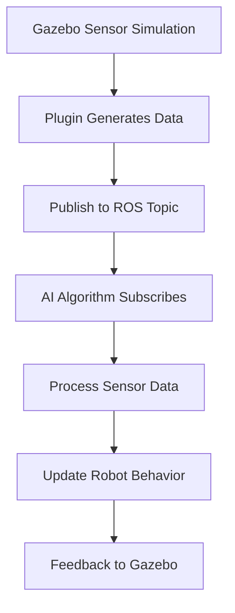

# Chapter 3: Sensors and Interaction in Simulation

## The Importance of Sensors in Physical AI

Sensors are the bridge between the physical world and AI systems. In robotics, sensors provide the essential data that allows AI algorithms to perceive and understand their environment. For Physical AI systems, accurate sensor simulation is crucial for:

- **Perception**: Understanding the environment through sensor data
- **Navigation**: Planning paths and avoiding obstacles
- **Interaction**: Manipulating objects and responding to environmental changes
- **Learning**: Training AI systems in a safe, repeatable environment

Without accurate sensor simulation, AI systems trained in Digital Twins would not transfer effectively to real robots, defeating the purpose of the simulation approach.

## Simulating LiDAR Sensors

LiDAR (Light Detection and Ranging) sensors are crucial for robotics applications, providing accurate 3D spatial information. In simulation, LiDAR sensors work by:

- Emitting laser beams in multiple directions
- Measuring the time it takes for each beam to return after hitting an object
- Calculating distances based on the time-of-flight

### LiDAR Configuration in Gazebo

```xml
<sensor name="lidar_sensor" type="ray">
  <ray>
    <scan>
      <horizontal>
        <samples>720</samples>
        <resolution>1</resolution>
        <min_angle>-1.570796</min_angle>
        <max_angle>1.570796</max_angle>
      </horizontal>
    </scan>
    <range>
      <min>0.1</min>
      <max>30.0</max>
      <resolution>0.01</resolution>
    </range>
  </ray>
  <plugin name="lidar_controller" filename="libgazebo_ros_ray_sensor.so">
    <ros>
      <namespace>/lidar</namespace>
      <remapping>~/out:=scan</remapping>
    </ros>
    <output_type>sensor_msgs/LaserScan</output_type>
  </plugin>
</sensor>
```

This configuration creates a LiDAR sensor with 720 samples spanning 180 degrees, with a range of 0.1m to 30m. The plugin publishes sensor data to ROS 2 topics as LaserScan messages.

### Real-World LiDAR Considerations

When simulating LiDAR, it's important to model real-world limitations:
- **Resolution**: Real LiDAR has limited angular resolution
- **Range limits**: Objects beyond maximum range return no data
- **Noise**: Real sensors have measurement noise and inaccuracies
- **Occlusion**: Certain areas may be shadowed by the robot's own structure

## Simulating Depth Cameras

Depth cameras provide both visual information and depth data, making them valuable for perception tasks. They work by:

- Capturing color (RGB) images
- Simultaneously capturing depth information for each pixel
- Enabling 3D reconstruction and spatial understanding

### Depth Camera Configuration

```xml
<sensor name="depth_camera" type="depth">
  <camera>
    <horizontal_fov>1.047</horizontal_fov>
    <image>
      <width>640</width>
      <height>480</height>
      <format>R8G8B8</format>
    </image>
    <clip>
      <near>0.1</near>
      <far>10</far>
    </clip>
  </camera>
  <plugin name="camera_controller" filename="libgazebo_ros_openni_kinect.so">
    <baseline>0.2</baseline>
    <always_on>true</always_on>
    <update_rate>10</update_rate>
    <camera_name>depth_camera</camera_name>
    <image_topic_name>/rgb/image_raw</image_topic_name>
    <depth_image_topic_name>/depth/image_raw</depth_image_topic_name>
    <point_cloud_topic_name>/depth/points</point_cloud_topic_name>
  </plugin>
</sensor>
```

This configuration creates a depth camera that publishes RGB images, depth images, and point clouds to separate ROS 2 topics.

### Applications of Depth Cameras

Depth cameras are particularly useful for:
- **Object recognition**: Combining visual and spatial information
- **SLAM (Simultaneous Localization and Mapping)**: Building 3D maps of the environment
- **Grasping and manipulation**: Understanding object poses and shapes
- **Human-robot interaction**: Recognizing gestures and expressions

## Simulating IMUs (Inertial Measurement Units)

IMUs are critical for robot navigation and control, measuring:

- **Linear acceleration** along three axes (x, y, z)
- **Angular velocity** around three axes (roll, pitch, yaw)
- **Orientation** relative to the Earth's gravitational field

### IMU Configuration in Simulation

```xml
<sensor name="imu_sensor" type="imu">
  <always_on>true</always_on>
  <update_rate>100</update_rate>
  <imu>
    <angular_velocity>
      <x>
        <noise type="gaussian">
          <mean>0.0</mean>
          <stddev>0.001</stddev>
        </noise>
      </x>
      <y>
        <noise type="gaussian">
          <mean>0.0</mean>
          <stddev>0.001</stddev>
        </noise>
      </y>
      <z>
        <noise type="gaussian">
          <mean>0.0</mean>
          <stddev>0.001</stddev>
        </noise>
      </z>
    </angular_velocity>
    <linear_acceleration>
      <x>
        <noise type="gaussian">
          <mean>0.0</mean>
          <stddev>0.017</stddev>
        </noise>
      </x>
      <y>
        <noise type="gaussian">
          <mean>0.0</mean>
          <stddev>0.017</stddev>
        </noise>
      </y>
      <z>
        <noise type="gaussian">
          <mean>0.0</mean>
          <stddev>0.017</stddev>
        </noise>
      </z>
    </linear_acceleration>
  </imu>
</sensor>
```

This configuration creates an IMU with realistic noise models that match real sensor characteristics.

### IMU Applications

IMUs are essential for:
- **Balance and stabilization**: Keeping humanoid robots upright
- **Motion tracking**: Understanding robot movement and orientation
- **Sensor fusion**: Combining with other sensors for accurate state estimation
- **Control systems**: Providing feedback for control algorithms

## Sensor Data Flow into ROS 2

### The Sensor Data Pipeline

In a simulated environment, sensor data flows through ROS 2 as follows:

1. **Sensor Simulation**: Gazebo simulates the physical sensor behavior
2. **Data Generation**: Sensor plugins generate data in standard ROS 2 message formats
3. **Message Publishing**: Sensor data is published to ROS 2 topics
4. **AI Processing**: AI algorithms subscribe to sensor topics and process the data
5. **Robot Control**: Processed sensor data influences robot behavior and actions

### Common Sensor Message Types

- **sensor_msgs/LaserScan**: For LiDAR data containing distance measurements
- **sensor_msgs/Image**: For camera images in various formats
- **sensor_msgs/PointCloud2**: For 3D point cloud data from depth sensors
- **sensor_msgs/Imu**: For IMU data containing orientation and acceleration
- **sensor_msgs/JointState**: For joint position, velocity, and effort data

### Example Sensor Data Processing Pipeline



This pipeline enables tight integration between simulated sensors and AI algorithms.

## Unity's Role in Visualization and HRI

### High-Fidelity Visualization

Unity provides advanced visualization capabilities that complement Gazebo's physics simulation:

- **Realistic Rendering**: Advanced lighting, materials, and textures for photorealistic scenes
- **Virtual Reality**: Support for VR interfaces for immersive testing and operation
- **Augmented Reality**: Integration with AR for mixed reality applications
- **Advanced Graphics**: Real-time ray tracing and other advanced rendering techniques

### Human-Robot Interaction (HRI) Research

Unity is particularly valuable for HRI research because it can:
- Simulate realistic human behaviors and actions
- Provide intuitive interfaces for human operators
- Test collaborative scenarios in a safe environment
- Create immersive environments for human-robot studies

### Unity-Gazebo Integration

While Unity excels at visualization and HRI, Gazebo excels at physics simulation. The two can be integrated for optimal results:

- **Data Exchange**: Sensor data from Gazebo can be fed to Unity for visualization
- **Control Interface**: Unity interfaces can send control commands to Gazebo
- **Shared Environment**: Both systems can represent the same environment with different strengths

## Readiness for AI Perception and Training Pipelines

### Simulation-to-Reality Transfer

To prepare for real-world deployment, simulated sensors should:
- Include realistic noise models that match real sensors
- Account for sensor limitations and failure modes
- Provide sufficient data diversity for robust AI training
- Model the "reality gap" to help algorithms generalize

### Training Pipeline Integration

Simulated sensor data can be used to:
- Pre-train AI models before real-world data collection
- Generate diverse training scenarios safely
- Validate perception algorithms before hardware testing
- Create large datasets for deep learning applications

### Sensor Fusion in Simulation

Real robots rarely rely on a single sensor type. In simulation, you can test sensor fusion approaches:

- **LiDAR + Camera**: Combining spatial and visual information
- **IMU + Encoders**: Improving localization accuracy
- **Multiple sensors**: Creating redundant sensing systems
- **Cross-validation**: Using different sensors to validate each other

<details>
<summary>Advanced: Sensor Calibration and Noise Modeling</summary>

Accurate sensor simulation requires attention to calibration and noise characteristics:

**LiDAR Calibration**:
- **Intrinsic parameters**: Field of view, resolution, range limits
- **Extrinsic parameters**: Position and orientation relative to robot
- **Noise modeling**: Range accuracy, angular precision, dropouts

**Camera Calibration**:
- **Intrinsic parameters**: Focal length, principal point, distortion coefficients
- **Extrinsic parameters**: Position and orientation relative to robot
- **Noise modeling**: Image noise, compression artifacts, temporal delays

**IMU Calibration**:
- **Bias**: Constant offsets in measurements
- **Scale factor**: Deviations from ideal sensitivity
- **Alignment**: Misalignment between sensor axes and robot frame
- **Temperature effects**: Performance changes with temperature
- **Vibration sensitivity**: Response to mechanical vibrations
</details>

## Challenges and Limitations

### The Reality Gap for Sensors

Sensor simulation faces several challenges:
- **Material properties**: Real materials may behave differently than simulated ones
- **Environmental conditions**: Lighting, weather, and atmospheric effects
- **Sensor aging**: Real sensors degrade over time
- **Calibration drift**: Sensors may lose calibration during operation

### Best Practices for Sensor Simulation

- **Validate with real data**: Compare simulated and real sensor data
- **Model limitations**: Include realistic sensor limitations in simulation
- **Test edge cases**: Include rare but important sensor failure modes
- **Iterate and refine**: Continuously improve simulation based on real-world data

## Summary

In this chapter, you've learned about the critical role of sensors in Physical AI and how different types of sensors (LiDAR, depth cameras, IMUs) are simulated in digital twins. You now understand how sensor data flows into ROS 2 and the role of Unity in visualization and human-robot interaction. You've also seen how simulation prepares AI systems for real-world perception and training.

With all three chapters complete, you now have a comprehensive understanding of Digital Twins in robotics, from fundamental concepts through physics simulation to sensor systems. The Digital Twin approach provides a safe, cost-effective, and scalable way to develop and test robotics systems before real-world deployment.