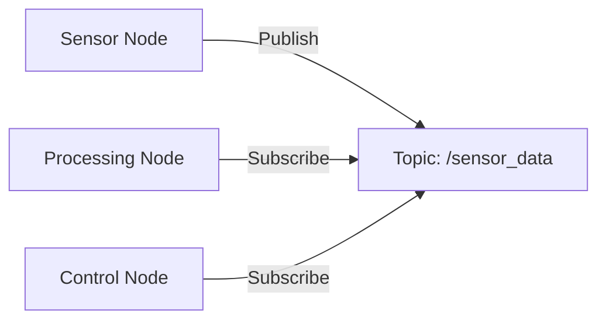

# Chapter 1: ROS 2 as the Robotic Nervous System

## Introduction to ROS 2

ROS 2 (Robot Operating System 2) serves as the nervous system for humanoid robots, enabling communication between software intelligence and physical robot components. Just as our nervous system allows our brain to communicate with our body, ROS 2 enables AI agents to control and receive feedback from robot hardware.

## Why ROS 2 is Essential for Physical AI

Physical AI requires a robust communication framework to connect decision-making algorithms with physical actuators and sensors. ROS 2 provides this framework through:

- **Middleware Architecture**: A standardized communication layer
- **Distributed Computing**: Support for multiple computers in a robot system
- **Real-time Capabilities**: Deterministic behavior for safety-critical applications
- **Security Features**: Built-in security for connected robotic systems

## Core Components of ROS 2

### Nodes
Nodes are the fundamental building blocks of ROS 2 systems. Think of them as individual neurons in a biological nervous system. Each node performs a specific function, such as controlling a sensor, processing data, or managing robot behavior.

```python
import rclpy
from rclpy.node import Node

class RobotSensorNode(Node):
    def __init__(self):
        super().__init__('sensor_node')
        self.get_logger().info('Sensor node initialized')
```

<details>
<summary>Advanced: Node Lifecycle</summary>

In complex robotic systems, nodes may have different lifecycle states:
- Unconfigured
- Inactive
- Active
- Finalized

This allows for more controlled system startup and shutdown.
</details>

### Topics
Topics are communication channels that allow nodes to exchange data. Like the synapses between neurons, topics enable message passing between nodes. Data flows from publishers to subscribers in a decoupled manner.

### Services
Services provide request-response communication patterns. When a node needs specific information or wants to trigger a specific action, it can call a service. This is similar to how certain brain regions send specific signals to trigger particular responses.

## Message Passing in ROS 2

ROS 2 uses a publish-subscribe model for most communications. Nodes publish messages to topics, and other nodes subscribe to those topics to receive the messages. This pattern allows for flexible, decoupled system design.



## The Nervous System Analogy

To better understand ROS 2 architecture, consider the human nervous system:

- **Central Processing**: Like the brain, a central AI node processes high-level decisions
- **Sensory Input**: Like sensory neurons, sensor nodes collect data from the environment
- **Motor Output**: Like motor neurons, control nodes send commands to actuators
- **Communication Pathways**: Like neural pathways, topics and services carry information between components

This analogy helps visualize how different components of a robotic system interact and communicate.

## Summary

In this chapter, you've learned that ROS 2 serves as the nervous system for robots, providing the communication infrastructure needed for AI agents to interact with physical components. You now understand the core components: nodes, topics, and services, and how they relate to biological nervous systems.

In the next chapter, we'll explore how to implement these concepts using Python and the rclpy library.