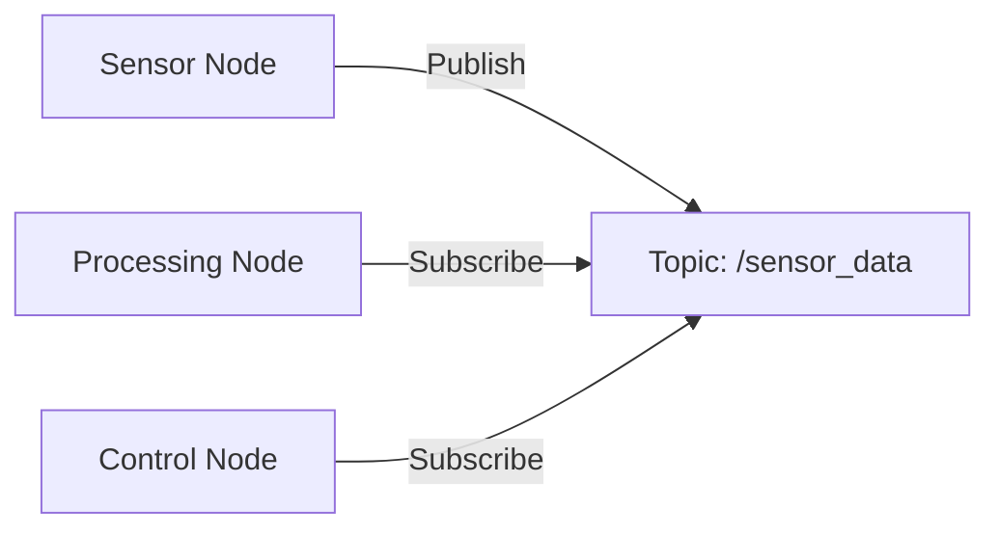

# Quickstart Guide: ROS 2 Module Implementation

**Feature**: 01-ros2-nervous-system
**Date**: 2025-12-25

## Overview
This quickstart guide provides the essential steps to implement the ROS 2 module in the Docusaurus project. The module consists of three chapters that introduce ROS 2 as the robotic nervous system, explain Python communication with ROS 2, and cover URDF robot descriptions.

## Prerequisites
- Node.js and npm installed
- Docusaurus project set up in `/frontend` directory
- Basic understanding of Markdown and Docusaurus structure

## Step-by-Step Implementation

### 1. Set Up Directory Structure
```bash
cd frontend
mkdir -p docs/modules/ros2
```

### 2. Create Module Index Page
Create `frontend/docs/modules/ros2/index.md`:
```markdown
---
sidebar_position: 1
title: ROS 2 - The Robotic Nervous System
---

# ROS 2 - The Robotic Nervous System

Welcome to the ROS 2 module, where you'll learn how ROS 2 serves as the nervous system for humanoid robots. This module is designed for computer science and AI students, robotics beginners with Python knowledge, and learners transitioning from pure AI/software to Physical AI systems.

## What You'll Learn

In this module, you'll explore:

1. **ROS 2 Architecture**: Understand how ROS 2 functions as the nervous system of robots
2. **Python Communication**: Learn to connect Python-based AI agents to ROS 2 controllers
3. **URDF Robot Descriptions**: Explore how robots are described and prepared for simulation

Each chapter builds upon the previous one, taking you from concepts through communication to embodiment.

## Prerequisites

- Basic Python knowledge
- Familiarity with software concepts
- Interest in robotics and AI integration

Let's begin our journey into the robotic nervous system!
```

### 3. Create Chapter 1 - ROS 2 as the Robotic Nervous System
Create `frontend/docs/modules/ros2/chapter1.md`:
```markdown
---
sidebar_position: 2
title: Chapter 1 - ROS 2 as the Robotic Nervous System
---

# Chapter 1: ROS 2 as the Robotic Nervous System

## Introduction to ROS 2

ROS 2 (Robot Operating System 2) serves as the nervous system for humanoid robots, enabling communication between software intelligence and physical robot components. Just as our nervous system allows our brain to communicate with our body, ROS 2 enables AI agents to control and receive feedback from robot hardware.

## Why ROS 2 is Essential for Physical AI

Physical AI requires a robust communication framework to connect decision-making algorithms with physical actuators and sensors. ROS 2 provides this framework through:

- **Middleware Architecture**: A standardized communication layer
- **Distributed Computing**: Support for multiple computers in a robot system
- **Real-time Capabilities**: Deterministic behavior for safety-critical applications
- **Security Features**: Built-in security for connected robotic systems

## Core Components of ROS 2

### Nodes
Nodes are the fundamental building blocks of ROS 2 systems. Think of them as individual neurons in a biological nervous system. Each node performs a specific function, such as controlling a sensor, processing data, or managing robot behavior.

```python
import rclpy
from rclpy.node import Node

class RobotSensorNode(Node):
    def __init__(self):
        super().__init__('sensor_node')
        self.get_logger().info('Sensor node initialized')
```

<details>
<summary>Advanced: Node Lifecycle</summary>

In complex robotic systems, nodes may have different lifecycle states:
- Unconfigured
- Inactive
- Active
- Finalized

This allows for more controlled system startup and shutdown.
</details>

### Topics
Topics are communication channels that allow nodes to exchange data. Like the synapses between neurons, topics enable message passing between nodes. Data flows from publishers to subscribers in a decoupled manner.

### Services
Services provide request-response communication patterns. When a node needs specific information or wants to trigger a specific action, it can call a service. This is similar to how certain brain regions send specific signals to trigger particular responses.

## Message Passing in ROS 2

ROS 2 uses a publish-subscribe model for most communications. Nodes publish messages to topics, and other nodes subscribe to those topics to receive the messages. This pattern allows for flexible, decoupled system design.



## The Nervous System Analogy

To better understand ROS 2 architecture, consider the human nervous system:

- **Central Processing**: Like the brain, a central AI node processes high-level decisions
- **Sensory Input**: Like sensory neurons, sensor nodes collect data from the environment
- **Motor Output**: Like motor neurons, control nodes send commands to actuators
- **Communication Pathways**: Like neural pathways, topics and services carry information between components

This analogy helps visualize how different components of a robotic system interact and communicate.

## Summary

In this chapter, you've learned that ROS 2 serves as the nervous system for robots, providing the communication infrastructure needed for AI agents to interact with physical components. You now understand the core components: nodes, topics, and services, and how they relate to biological nervous systems.

In the next chapter, we'll explore how to implement these concepts using Python and the rclpy library.
```

### 4. Create Chapter 2 - Python Agents and ROS 2 Communication
Create `frontend/docs/modules/ros2/chapter2.md`:
```markdown
---
sidebar_position: 3
title: Chapter 2 - Python Agents and ROS 2 Communication
---

# Chapter 2: Python Agents and ROS 2 Communication

## The Role of Python in Robotics and AI Integration

Python has become the dominant language for AI and robotics development due to its simplicity, extensive libraries, and strong community support. In the context of ROS 2, Python serves as the bridge between high-level AI algorithms and the robotic control system.

## Using rclpy to Create ROS 2 Nodes

The `rclpy` library is the Python client library for ROS 2. It provides the tools needed to create nodes, publish and subscribe to topics, and provide or call services.

### Creating Your First Node

Let's create a simple node that publishes sensor data:

```python
import rclpy
from rclpy.node import Node
from std_msgs.msg import String

class SensorPublisher(Node):
    def __init__(self):
        super().__init__('sensor_publisher')
        self.publisher_ = self.create_publisher(String, 'sensor_data', 10)
        timer_period = 0.5  # seconds
        self.timer = self.create_timer(timer_period, self.timer_callback)
        self.i = 0

    def timer_callback(self):
        msg = String()
        msg.data = f'Sensor reading: {self.i}'
        self.publisher_.publish(msg)
        self.get_logger().info(f'Publishing: "{msg.data}"')
        self.i += 1

def main(args=None):
    rclpy.init(args=args)
    sensor_publisher = SensorPublisher()
    rclpy.spin(sensor_publisher)
    sensor_publisher.destroy_node()
    rclpy.shutdown()

if __name__ == '__main__':
    main()
```

### Publishing and Subscribing to Topics

In ROS 2, nodes communicate through topics using a publish-subscribe pattern. Let's look at how to create a subscriber:

```python
import rclpy
from rclpy.node import Node
from std_msgs.msg import String

class SensorSubscriber(Node):
    def __init__(self):
        super().__init__('sensor_subscriber')
        self.subscription = self.create_subscription(
            String,
            'sensor_data',
            self.listener_callback,
            10)
        self.subscription  # prevent unused variable warning

    def listener_callback(self, msg):
        self.get_logger().info(f'I heard: "{msg.data}"')

def main(args=None):
    rclpy.init(args=args)
    sensor_subscriber = SensorSubscriber()
    rclpy.spin(sensor_subscriber)
    sensor_subscriber.destroy_node()
    rclpy.shutdown()

if __name__ == '__main__':
    main()
```

## Calling and Exposing Services

Services provide a request-response communication pattern in ROS 2. Here's how to create a service server:

```python
from add_two_ints_srv.srv import AddTwoInts
import rclpy
from rclpy.node import Node

class MinimalService(Node):
    def __init__(self):
        super().__init__('minimal_service')
        self.srv = self.create_service(AddTwoInts, 'add_two_ints', self.add_two_ints_callback)

    def add_two_ints_callback(self, request, response):
        response.sum = request.a + request.b
        self.get_logger().info(f'Returning {request.a} + {request.b} = {response.sum}')
        return response

def main(args=None):
    rclpy.init(args=args)
    minimal_service = MinimalService()
    rclpy.spin(minimal_service)
    rclpy.shutdown()

if __name__ == '__main__':
    main()
```

And here's how to call that service:

```python
from add_two_ints_srv.srv import AddTwoInts
import rclpy
from rclpy.node import Node

class MinimalClientAsync(Node):
    def __init__(self):
        super().__init__('minimal_client_async')
        self.cli = self.create_client(AddTwoInts, 'add_two_ints')
        while not self.cli.wait_for_service(timeout_sec=1.0):
            self.get_logger().info('service not available, waiting again...')
        self.req = AddTwoInts.Request()

    def send_request(self, a, b):
        self.req.a = a
        self.req.b = b
        self.future = self.cli.call_async(self.req)
        rclpy.spin_until_future_complete(self, self.future)
        return self.future.result()

def main(args=None):
    rclpy.init(args=args)
    minimal_client = MinimalClientAsync()
    response = minimal_client.send_request(1, 2)
    minimal_client.get_logger().info(f'Result: {response.sum}')
    minimal_client.destroy_node()
    rclpy.shutdown()

if __name__ == '__main__':
    main()
```

## Bridging AI Logic to Motor and Sensor Control

One of the key challenges in robotics is connecting high-level AI decision-making with low-level motor and sensor control. This bridge is typically achieved through a multi-layered architecture:

1. **AI Layer**: High-level decision making
2. **Behavior Layer**: Translate decisions into robot behaviors
3. **Motion Layer**: Convert behaviors into specific movements
4. **Hardware Layer**: Direct control of actuators and sensors

```python
import rclpy
from rclpy.node import Node
from std_msgs.msg import String
from geometry_msgs.msg import Twist  # For robot movement

class AIBridgeNode(Node):
    def __init__(self):
        super().__init__('ai_bridge_node')

        # Subscribe to sensor data
        self.sensor_subscription = self.create_subscription(
            String,
            'sensor_data',
            self.sensor_callback,
            10)

        # Publish movement commands
        self.movement_publisher = self.create_publisher(Twist, 'cmd_vel', 10)

        # Timer for AI decision making
        self.timer = self.create_timer(0.1, self.ai_decision_callback)

        self.latest_sensor_data = None

    def sensor_callback(self, msg):
        self.latest_sensor_data = msg.data
        self.get_logger().info(f'Received sensor data: {msg.data}')

    def ai_decision_callback(self):
        if self.latest_sensor_data:
            # Simple AI logic: if sensor detects obstacle, move backward
            if 'obstacle' in self.latest_sensor_data:
                self.move_backward()
            else:
                self.move_forward()

    def move_forward(self):
        msg = Twist()
        msg.linear.x = 0.5  # Move forward at 0.5 m/s
        self.movement_publisher.publish(msg)
        self.get_logger().info('Moving forward')

    def move_backward(self):
        msg = Twist()
        msg.linear.x = -0.5  # Move backward at 0.5 m/s
        self.movement_publisher.publish(msg)
        self.get_logger().info('Moving backward')

def main(args=None):
    rclpy.init(args=args)
    ai_bridge = AIBridgeNode()
    rclpy.spin(ai_bridge)
    ai_bridge.destroy_node()
    rclpy.shutdown()

if __name__ == '__main__':
    main()
```

<details>
<summary>Advanced: Quality of Service (QoS) Settings</summary>

In production robotics, you may need to configure Quality of Service settings for different communication requirements:

- Reliability: Best effort vs. reliable
- Durability: Volatile vs. transient local
- History: Keep last N vs. keep all

These settings affect how messages are delivered and stored.
</details>

## Summary

In this chapter, you've learned how to use Python and rclpy to create ROS 2 nodes that can publish/subscribe to topics and call/expose services. You've seen practical examples of connecting AI logic to motor and sensor control, which is essential for creating intelligent robotic systems.

In the next chapter, we'll explore how robots are described in URDF and how this connects software to physical structure.
```

### 5. Create Chapter 3 - Humanoid Robot Description with URDF
Create `frontend/docs/modules/ros2/chapter3.md`:
```markdown
---
sidebar_position: 4
title: Chapter 3 - Humanoid Robot Description with URDF
---

# Chapter 3: Humanoid Robot Description with URDF

## The Purpose of URDF in Humanoid Robotics

URDF (Unified Robot Description Format) is an XML-based format used to describe robot models in ROS. For humanoid robots, URDF serves as the blueprint that defines the robot's physical structure, including links (rigid parts), joints (connections between parts), and other properties like visual appearance and collision geometry.

URDF is crucial because it bridges the gap between software algorithms and physical robot hardware. Without an accurate robot description, algorithms can't understand the robot's structure, limiting the effectiveness of control, planning, and simulation.

## Links, Joints, and Coordinate Frames

### Links
Links represent the rigid parts of a robot. In a humanoid robot, examples include:
- Torso
- Upper arm
- Lower arm
- Hand
- Thigh
- Shin
- Foot

Each link has properties like:
- Mass
- Inertia
- Visual representation
- Collision representation

### Joints
Joints define how links connect and move relative to each other. Common joint types include:
- **Revolute**: Rotational joint with a single axis of rotation
- **Prismatic**: Linear sliding joint
- **Fixed**: No movement between links
- **Continuous**: Rotational joint without limits
- **Planar**: Movement on a plane
- **Floating**: 6 degrees of freedom

### Coordinate Frames
Each link has its own coordinate frame, typically defined at the joint connecting it to its parent. These frames establish the spatial relationship between different parts of the robot and are essential for:
- Kinematics calculations
- Motion planning
- Sensor data interpretation

## How URDF Connects Software to Physical Structure

URDF files serve multiple purposes in the software-to-hardware pipeline:

1. **Simulation**: URDF models are used in physics simulators like Gazebo
2. **Visualization**: Tools like RViz use URDF to visualize the robot
3. **Kinematics**: Forward and inverse kinematics algorithms use URDF structure
4. **Collision Detection**: URDF collision meshes are used for safety checks
5. **Control**: Joint limits and properties from URDF inform control algorithms

## High-Level Explanation of Humanoid Kinematics

Humanoid kinematics involves understanding how joint angles relate to end-effector positions (like hand or foot positions). There are two main problems:

### Forward Kinematics
Given joint angles, calculate the position and orientation of end-effectors. This is relatively straightforward mathematically.

### Inverse Kinematics
Given a desired end-effector position, calculate the required joint angles. This is more complex and may have multiple solutions or no solution.

For humanoid robots, kinematics is particularly important for:
- Walking and balance control
- Manipulation tasks
- Motion planning
- Trajectory generation

## A Basic URDF Example

Here's a simplified URDF for a 2-joint robot arm:

```xml
<?xml version="1.0"?>
<robot name="simple_arm">
  <!-- Base link -->
  <link name="base_link">
    <visual>
      <geometry>
        <cylinder length="0.1" radius="0.1"/>
      </geometry>
      <material name="blue">
        <color rgba="0 0 1 1"/>
      </material>
    </visual>
    <collision>
      <geometry>
        <cylinder length="0.1" radius="0.1"/>
      </geometry>
    </collision>
    <inertial>
      <mass value="1"/>
      <inertia ixx="0.01" ixy="0" ixz="0" iyy="0.01" iyz="0" izz="0.01"/>
    </inertial>
  </link>

  <!-- First joint -->
  <joint name="joint1" type="revolute">
    <parent link="base_link"/>
    <child link="link1"/>
    <origin xyz="0 0 0.05" rpy="0 0 0"/>
    <axis xyz="0 0 1"/>
    <limit lower="-1.57" upper="1.57" effort="100" velocity="1"/>
  </joint>

  <!-- First link -->
  <link name="link1">
    <visual>
      <geometry>
        <cylinder length="0.5" radius="0.05"/>
      </geometry>
      <material name="red">
        <color rgba="1 0 0 1"/>
      </material>
    </visual>
    <collision>
      <geometry>
        <cylinder length="0.5" radius="0.05"/>
      </geometry>
    </collision>
    <inertial>
      <mass value="0.5"/>
      <inertia ixx="0.01" ixy="0" ixz="0" iyy="0.01" iyz="0" izz="0.01"/>
    </inertial>
  </link>

  <!-- Second joint -->
  <joint name="joint2" type="revolute">
    <parent link="link1"/>
    <child link="end_effector"/>
    <origin xyz="0 0 0.25" rpy="0 0 0"/>
    <axis xyz="0 1 0"/>
    <limit lower="-1.57" upper="1.57" effort="100" velocity="1"/>
  </joint>

  <!-- End effector -->
  <link name="end_effector">
    <visual>
      <geometry>
        <sphere radius="0.05"/>
      </geometry>
      <material name="green">
        <color rgba="0 1 0 1"/>
      </material>
    </visual>
    <collision>
      <geometry>
        <sphere radius="0.05"/>
      </geometry>
    </collision>
    <inertial>
      <mass value="0.1"/>
      <inertia ixx="0.001" ixy="0" ixz="0" iyy="0.001" iyz="0" izz="0.001"/>
    </inertial>
  </link>
</robot>
```

## Preparing Robot Models for Simulation

To prepare URDF models for simulation in Gazebo or other simulators, you typically need to add additional elements:

### Transmission Elements
These define how actuators connect to joints:

```xml
<transmission name="joint1_trans">
  <type>transmission_interface/SimpleTransmission</type>
  <joint name="joint1">
    <hardwareInterface>hardware_interface/PositionJointInterface</hardwareInterface>
  </joint>
  <actuator name="joint1_motor">
    <hardwareInterface>hardware_interface/PositionJointInterface</hardwareInterface>
    <mechanicalReduction>1</mechanicalReduction>
  </actuator>
</transmission>
```

### Gazebo-Specific Elements
These define how the model appears and behaves in Gazebo:

```xml
<gazebo reference="base_link">
  <material>Gazebo/Blue</material>
  <mu1>0.2</mu1>
  <mu2>0.2</mu2>
</gazebo>
```

## Isaac Sim Readiness

For use with Isaac Sim (NVIDIA's robotics simulator), URDF files may need additional processing or conversion to USD (Universal Scene Description) format. Isaac Sim also supports some URDF directly but may require:

- Proper joint limits and types
- Collision and visual mesh definitions
- Material specifications
- Inertial properties for physics simulation

<details>
<summary>Advanced: Xacro for Complex Robots</summary>

For complex robots with many repeated elements, Xacro (XML Macros) is used to simplify URDF creation:

```xml
<?xml version="1.0"?>
<robot xmlns:xacro="http://www.ros.org/wiki/xacro" name="complex_robot">
  <xacro:property name="M_PI" value="3.1415926535897931" />

  <xacro:macro name="simple_arm" params="prefix parent *origin">
    <joint name="${prefix}_joint" type="revolute">
      <xacro:insert_block name="origin"/>
      <parent link="${parent}"/>
      <child link="${prefix}_link"/>
      <axis xyz="0 1 0"/>
      <limit lower="${-2*M_PI}" upper="${2*M_PI}" effort="30" velocity="1.0"/>
    </joint>

    <link name="${prefix}_link">
      <visual>
        <geometry>
          <cylinder radius="0.02" length="0.5"/>
        </geometry>
        <origin xyz="0 0 0.25" rpy="0 0 0"/>
      </visual>
    </link>
  </xacro:macro>
</robot>
```
</details>

## Summary

In this chapter, you've learned about URDF (Unified Robot Description Format) and its crucial role in connecting software algorithms to physical robot structure. You now understand how links, joints, and coordinate frames define a robot's structure, how URDF enables various robotics applications, and the basics of humanoid kinematics. You've also seen how to prepare robot models for simulation in Gazebo and Isaac Sim.

With all three chapters complete, you now have a comprehensive understanding of ROS 2 as the robotic nervous system, how to connect Python AI agents to ROS 2, and how robots are described using URDF.
```

### 6. Update Sidebar Configuration
Update `frontend/sidebars.ts` to include the new module:
```typescript
import type {SidebarsConfig} from '@docusaurus/plugin-content-docs';

// This runs in Node.js - Don't use client-side code here (browser APIs, JSX...)

/**
 * Creating a sidebar enables you to:
 - create an ordered group of docs
 - render a sidebar for each doc of that group
 - provide next/previous navigation

 The sidebars can be generated from the filesystem, or explicitly defined here.

 Create as many sidebars as you want.
 */
const sidebars: SidebarsConfig = {
  // By default, Docusaurus generates a sidebar from the docs folder structure
  tutorialSidebar: [{type: 'autogenerated', dirName: '.'}],

  // Manual sidebar for the ROS2 module
  ros2ModuleSidebar: [
    {
      type: 'category',
      label: 'ROS 2 - The Robotic Nervous System',
      items: [
        'modules/ros2/index',
        'modules/ros2/chapter1',
        'modules/ros2/chapter2',
        'modules/ros2/chapter3'
      ],
    },
  ],

  // But you can create a sidebar manually
  /*
  tutorialSidebar: [
    'intro',
    'hello',
    {
      type: 'category',
      label: 'Tutorial',
      items: ['tutorial-basics/create-a-document'],
    },
  ],
   */
};

export default sidebars;
```

### 7. Update Navigation (Optional)
If you want to add the module to the main navigation bar, update `frontend/docusaurus.config.ts`:

In the navbar items array, add:
```typescript
{
  type: 'docSidebar',
  sidebarId: 'ros2ModuleSidebar',
  position: 'left',
  label: 'ROS 2 Module',
},
```

## Testing the Implementation

1. Navigate to the frontend directory:
```bash
cd frontend
```

2. Start the development server:
```bash
npm start
```

3. Verify that:
- The new module appears in the navigation
- All three chapters are accessible
- Diagrams render correctly
- Code snippets display with proper syntax highlighting
- Collapsible sections work properly
- Navigation between chapters works as expected

## Next Steps

After successful implementation:
1. Review content for clarity and accuracy
2. Test on different screen sizes for responsive design
3. Verify all links and navigation work correctly
4. Consider adding additional examples or exercises
5. Plan for future modules that could build on this foundation