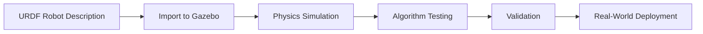
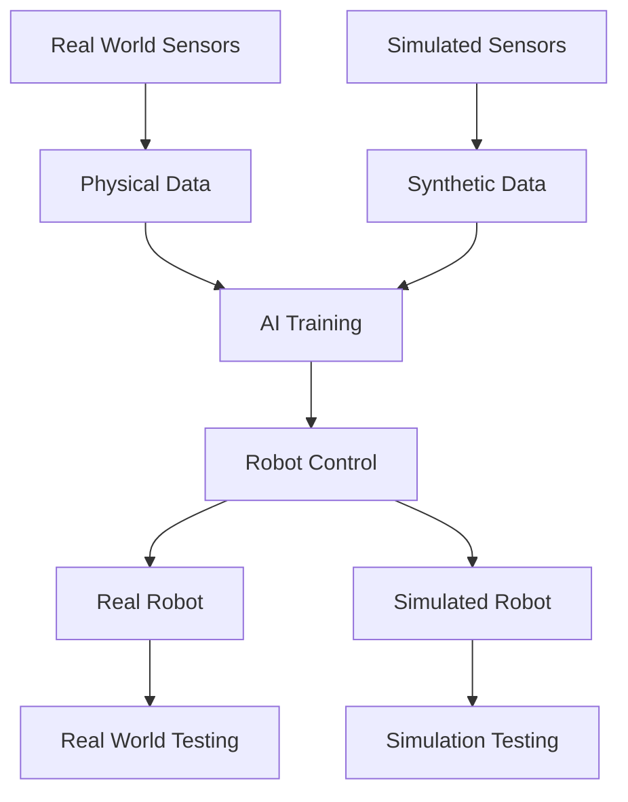

# Quickstart Guide: Digital Twin Module Implementation

**Feature**: 03-digital-twin-simulation
**Date**: 2025-12-25

## Overview
This quickstart guide provides the essential steps to implement the Digital Twin module in the Docusaurus project. The module covers Gazebo and Unity simulation concepts for humanoid robots, with three chapters focusing on Digital Twins, physics simulation, and sensor simulation.

## Prerequisites
- Node.js and npm installed
- Docusaurus project set up in `/frontend` directory
- Basic understanding of Markdown and Docusaurus structure

## Step-by-Step Implementation

### 1. Set Up Directory Structure
```bash
cd frontend
mkdir -p docs/modules/digital-twin
```

### 2. Create Module Index Page
Create `frontend/docs/modules/digital-twin/index.md`:
```markdown
---
sidebar_position: 1
title: Module 02 - The Digital Twin
---

# Module 02: The Digital Twin (Gazebo & Unity)

Welcome to the Digital Twin module, where you'll learn how simulated environments replicate real-world physics, sensors, and interactions for safe testing and training of Physical AI systems before real-world deployment.

This module is designed for AI and robotics students with basic ROS 2 understanding, learners transitioning from software-only AI to simulation-based robotics, and developers interested in robot simulation and environment modeling.

## What You'll Learn

In this module, you'll explore:

1. **Digital Twins in Robotics**: Understand the definition and purpose of Digital Twins and why simulation is critical for humanoid robots
2. **Physics Simulation with Gazebo**: Learn how to simulate gravity, collisions, friction, and build environments in Gazebo
3. **Sensors and Interaction in Simulation**: Explore how to simulate sensors like LiDAR, depth cameras, and IMUs

Each chapter builds upon the previous one, taking you from fundamental Digital Twin concepts to practical simulation applications.

## Prerequisites

- Basic understanding of ROS 2 concepts
- Familiarity with robotics concepts
- Interest in simulation and virtual environments

Let's begin exploring the world of Digital Twins!
```

### 3. Create Chapter 1 - Digital Twins in Robotics
Create `frontend/docs/modules/digital-twin/chapter1.md`:
```markdown
---
sidebar_position: 2
title: Chapter 1 - Digital Twins in Robotics
---

# Chapter 1: Digital Twins in Robotics

## What is a Digital Twin?

A Digital Twin is a virtual representation of a physical robot that replicates real-world physics, sensors, and interactions for safe testing and training. In the context of robotics, a Digital Twin serves as a bridge between the virtual and physical worlds, allowing developers to test algorithms, validate behaviors, and train AI systems in a risk-free environment.

## Why Simulation is Critical for Humanoid Robots

Simulation is especially critical for humanoid robots for several important reasons:

- **Safety**: Testing complex movements and interactions in simulation prevents potential damage to expensive hardware
- **Cost-effectiveness**: Simulation allows for rapid iteration and testing without physical prototypes
- **Risk reduction**: Algorithms can be validated in various scenarios before deployment
- **Repeatability**: Simulation provides consistent conditions for testing and debugging
- **Accessibility**: Complex environments and scenarios can be easily created and modified

## Differences Between Real Robots and Simulated Robots

While simulated robots aim to accurately represent their real-world counterparts, there are important differences to understand:

### Physical Properties
- **Real Robots**: Subject to manufacturing variations, wear and tear, sensor noise, and environmental factors
- **Simulated Robots**: Perfect geometric models with idealized physics properties

### Environmental Interaction
- **Real Robots**: Experience unpredictable environmental conditions, lighting changes, and physical disturbances
- **Simulated Robots**: Operate in controlled, predictable environments with known parameters

### Sensor Data
- **Real Robots**: Sensors produce noisy, imperfect data with real-world limitations
- **Simulated Robots**: Sensors can provide idealized or realistic noise models

## Overview of Gazebo and Unity in the Robotics Ecosystem

### Gazebo
Gazebo is a 3D simulation environment that provides:
- Realistic physics simulation with support for gravity, collisions, and friction
- A rich library of robots and environments
- Integration with ROS through the Gazebo ROS packages
- Sensor simulation capabilities for cameras, LiDAR, IMUs, and more

### Unity
Unity serves as a platform for:
- High-fidelity visualization and rendering
- Virtual reality and augmented reality applications
- Human-robot interaction (HRI) research
- Complex environment modeling with advanced graphics

## The Conceptual Flow: URDF → Simulation → Real-World Deployment

The typical workflow for using Digital Twins in robotics follows this pattern:

1. **URDF (Unified Robot Description Format)**: The robot is described in XML format, defining its physical structure, joints, and sensors
2. **Simulation Environment**: The URDF model is imported into simulation software like Gazebo where physics and sensor models are applied
3. **Testing and Validation**: Control algorithms and AI systems are tested in the simulated environment
4. **Real-World Deployment**: Once validated, the same algorithms are deployed to the physical robot



## Summary

In this chapter, you've learned that Digital Twins serve as critical tools for robotics development, allowing for safe and cost-effective testing of algorithms before real-world deployment. You now understand the differences between real and simulated robots, and the role of Gazebo and Unity in the robotics ecosystem.

In the next chapter, we'll explore the physics simulation concepts in Gazebo in detail.
```

### 4. Create Chapter 2 - Physics Simulation with Gazebo
Create `frontend/docs/modules/digital-twin/chapter2.md`:
```markdown
---
sidebar_position: 3
title: Chapter 2 - Physics Simulation with Gazebo
---

# Chapter 2: Physics Simulation with Gazebo

## Introduction to Physics Simulation

Physics simulation in robotics involves modeling real-world physical phenomena such as gravity, collisions, friction, and other forces that affect robot movement and interaction. Gazebo provides a realistic physics engine that enables accurate simulation of these phenomena.

## Simulating Gravity, Collisions, and Friction

### Gravity Simulation
Gravity is a fundamental force that affects all objects in the physical world. In Gazebo, gravity is simulated by applying a constant downward acceleration to all objects in the simulation environment. The default gravity value is approximately 9.81 m/s², matching Earth's gravitational acceleration.

```xml
<world>
  <gravity>0 0 -9.8</gravity>
</world>
```

### Collision Detection
Collision detection is essential for realistic robot simulation. Gazebo uses collision models to determine when two objects make contact. These models can be simplified geometric shapes (boxes, spheres, cylinders) or more complex meshes that closely match the object's visual appearance.

### Friction Modeling
Friction affects how objects interact with surfaces. Gazebo implements both static and dynamic friction models:
- **Static friction**: Prevents objects from starting to move
- **Dynamic friction**: Slows down moving objects

## Robot Joints and Motion Constraints

### Joint Types in Gazebo
Gazebo supports various joint types that correspond to different physical joint types:

- **Revolute**: Rotational joint with a single axis of rotation, limited by joint limits
- **Prismatic**: Linear sliding joint with one degree of freedom
- **Fixed**: No movement between links
- **Continuous**: Rotational joint without limits
- **Planar**: Movement constrained to a plane
- **Floating**: 6 degrees of freedom

### Joint Configuration Example
```xml
<joint name="shoulder_joint" type="revolute">
  <parent link="upper_arm"/>
  <child link="forearm"/>
  <axis xyz="0 1 0"/>
  <limit lower="-1.57" upper="1.57" effort="30" velocity="1.0"/>
</joint>
```

## Environment Building in Gazebo

### Creating Basic Environments
Gazebo allows you to create various environments for robot testing:

- **Floors**: Flat surfaces for robots to move on
- **Obstacles**: Objects for navigation and collision avoidance testing
- **Rooms**: Enclosed spaces with walls and doors

### Building with SDF (Simulation Description Format)
SDF is Gazebo's native format for describing environments:

```xml
<sdf version="1.6">
  <world name="default">
    <include>
      <uri>model://ground_plane</uri>
    </include>
    <include>
      <uri>model://sun</uri>
    </include>
    <model name="my_robot">
      <!-- Robot definition here -->
    </model>
    <model name="obstacle_box">
      <pose>2 0 0.5 0 0 0</pose>
      <link name="link">
        <collision name="collision">
          <geometry>
            <box><size>1 1 1</size></box>
          </geometry>
        </collision>
        <visual name="visual">
          <geometry>
            <box><size>1 1 1</size></box>
          </geometry>
        </visual>
      </link>
    </model>
  </world>
</sdf>
```

## Testing Humanoid Stability and Movement

### Stability Analysis
In simulation, you can test humanoid stability by:
- Applying external forces to test balance recovery
- Varying terrain conditions to test locomotion
- Testing different walking patterns and gaits

### Movement Validation
Gazebo allows you to validate movement patterns before real-world testing:
- Forward kinematics verification
- Inverse kinematics validation
- Path planning and obstacle avoidance testing

## Preparing Simulations for ROS 2 Integration

### ROS 2 Control Integration
Gazebo integrates with ROS 2 through several packages:
- `gazebo_ros_pkgs`: Provides ROS interfaces for Gazebo
- `ros2_control`: Framework for robot control
- `gazebo_ros2_control`: Bridge between Gazebo and ros2_control

### Example Controller Configuration
```yaml
controller_manager:
  ros__parameters:
    update_rate: 100  # Hz

    joint_state_broadcaster:
      type: joint_state_broadcaster/JointStateBroadcaster

    forward_position_controller:
      type: position_controllers/JointGroupPositionController
```

<details>
<summary>Advanced: Physics Engine Configuration</summary>

Gazebo uses the Open Dynamics Engine (ODE) as its default physics engine. You can configure various physics parameters:

- **Max Step Size**: Controls the time step for physics simulation
- **Real Time Update Rate**: Rate at which simulation time advances
- **Max Contacts**: Maximum number of contacts between two entities
- **CFM (Constraint Force Mixing)**: Affects constraint stability
- **ERP (Error Reduction Parameter)**: Controls error correction
</details>

## Summary

In this chapter, you've learned how Gazebo simulates physics phenomena including gravity, collisions, and friction. You now understand different joint types and how to build environments for robot testing. You've also seen how to prepare simulations for integration with ROS 2.

In the next chapter, we'll explore how sensors are simulated in digital twins.
```

### 5. Create Chapter 3 - Sensors and Interaction in Simulation
Create `frontend/docs/modules/digital-twin/chapter3.md`:
```markdown
---
sidebar_position: 4
title: Chapter 3 - Sensors and Interaction in Simulation
---

# Chapter 3: Sensors and Interaction in Simulation

## The Importance of Sensors in Physical AI

Sensors are the bridge between the physical world and AI systems. In robotics, sensors provide the essential data that allows AI algorithms to perceive and understand their environment. For Physical AI systems, accurate sensor simulation is crucial for:

- **Perception**: Understanding the environment through sensor data
- **Navigation**: Planning paths and avoiding obstacles
- **Interaction**: Manipulating objects and responding to environmental changes
- **Learning**: Training AI systems in a safe, repeatable environment

## Simulating LiDAR Sensors

LiDAR (Light Detection and Ranging) sensors are crucial for robotics applications, providing accurate 3D spatial information. In simulation, LiDAR sensors work by:

- Emitting laser beams in multiple directions
- Measuring the time it takes for each beam to return after hitting an object
- Calculating distances based on the time-of-flight

### LiDAR Configuration in Gazebo
```xml
<sensor name="lidar_sensor" type="ray">
  <ray>
    <scan>
      <horizontal>
        <samples>720</samples>
        <resolution>1</resolution>
        <min_angle>-1.570796</min_angle>
        <max_angle>1.570796</max_angle>
      </horizontal>
    </scan>
    <range>
      <min>0.1</min>
      <max>30.0</max>
      <resolution>0.01</resolution>
    </range>
  </ray>
  <plugin name="lidar_controller" filename="libgazebo_ros_ray_sensor.so">
    <ros>
      <namespace>/lidar</namespace>
      <remapping>~/out:=scan</remapping>
    </ros>
    <output_type>sensor_msgs/LaserScan</output_type>
  </plugin>
</sensor>
```

## Simulating Depth Cameras

Depth cameras provide both visual information and depth data, making them valuable for perception tasks. They work by:

- Capturing color (RGB) images
- Simultaneously capturing depth information for each pixel
- Enabling 3D reconstruction and spatial understanding

### Depth Camera Configuration
```xml
<sensor name="depth_camera" type="depth">
  <camera>
    <horizontal_fov>1.047</horizontal_fov>
    <image>
      <width>640</width>
      <height>480</height>
      <format>R8G8B8</format>
    </image>
    <clip>
      <near>0.1</near>
      <far>10</far>
    </clip>
  </camera>
  <plugin name="camera_controller" filename="libgazebo_ros_openni_kinect.so">
    <baseline>0.2</baseline>
    <always_on>true</always_on>
    <update_rate>10</update_rate>
    <camera_name>depth_camera</camera_name>
    <image_topic_name>/rgb/image_raw</image_topic_name>
    <depth_image_topic_name>/depth/image_raw</depth_image_topic_name>
    <point_cloud_topic_name>/depth/points</point_cloud_topic_name>
  </plugin>
</sensor>
```

## Simulating IMUs (Inertial Measurement Units)

IMUs are critical for robot navigation and control, measuring:

- **Linear acceleration** along three axes (x, y, z)
- **Angular velocity** around three axes (roll, pitch, yaw)
- **Orientation** relative to the Earth's gravitational field

### IMU Configuration in Simulation
```xml
<sensor name="imu_sensor" type="imu">
  <always_on>true</always_on>
  <update_rate>100</update_rate>
  <imu>
    <angular_velocity>
      <x>
        <noise type="gaussian">
          <mean>0.0</mean>
          <stddev>0.001</stddev>
        </noise>
      </x>
      <y>
        <noise type="gaussian">
          <mean>0.0</mean>
          <stddev>0.001</stddev>
        </noise>
      </y>
      <z>
        <noise type="gaussian">
          <mean>0.0</mean>
          <stddev>0.001</stddev>
        </noise>
      </z>
    </angular_velocity>
    <linear_acceleration>
      <x>
        <noise type="gaussian">
          <mean>0.0</mean>
          <stddev>0.017</stddev>
        </noise>
      </x>
      <y>
        <noise type="gaussian">
          <mean>0.0</mean>
          <stddev>0.017</stddev>
        </noise>
      </y>
      <z>
        <noise type="gaussian">
          <mean>0.0</mean>
          <stddev>0.017</stddev>
        </noise>
      </z>
    </linear_acceleration>
  </imu>
</sensor>
```

## Sensor Data Flow into ROS 2

### The Sensor Data Pipeline
In a simulated environment, sensor data flows through ROS 2 as follows:

1. **Sensor Simulation**: Gazebo simulates the physical sensor behavior
2. **Data Generation**: Sensor plugins generate data in standard ROS 2 message formats
3. **Message Publishing**: Sensor data is published to ROS 2 topics
4. **AI Processing**: AI algorithms subscribe to sensor topics and process the data
5. **Robot Control**: Processed sensor data influences robot behavior and actions

### Common Sensor Message Types
- **sensor_msgs/LaserScan**: For LiDAR data
- **sensor_msgs/Image**: For camera images
- **sensor_msgs/PointCloud2**: For 3D point cloud data
- **sensor_msgs/Imu**: For IMU data
- **sensor_msgs/JointState**: For joint position/velocity/effort

## Unity's Role in Visualization and HRI

### High-Fidelity Visualization
Unity provides advanced visualization capabilities that complement Gazebo's physics simulation:

- **Realistic Rendering**: Advanced lighting, materials, and textures
- **Virtual Reality**: Support for VR interfaces for immersive testing
- **Human-Robot Interaction**: Tools for simulating human-robot collaboration scenarios

### Human-Robot Interaction (HRI) Research
Unity is particularly valuable for HRI research because it can:
- Simulate realistic human behaviors and actions
- Provide intuitive interfaces for human operators
- Test collaborative scenarios in a safe environment

## Readiness for AI Perception and Training Pipelines

### Simulation-to-Reality Transfer
To prepare for real-world deployment, simulated sensors should:
- Include realistic noise models that match real sensors
- Account for sensor limitations and failure modes
- Provide sufficient data diversity for robust AI training

### Training Pipeline Integration
Simulated sensor data can be used to:
- Pre-train AI models before real-world data collection
- Generate diverse training scenarios safely
- Validate perception algorithms before hardware testing



## Summary

In this chapter, you've learned about the critical role of sensors in Physical AI and how different types of sensors (LiDAR, depth cameras, IMUs) are simulated in digital twins. You now understand how sensor data flows into ROS 2 and the role of Unity in visualization and human-robot interaction. You've also seen how simulation prepares AI systems for real-world perception and training.

With all three chapters complete, you now have a comprehensive understanding of Digital Twins in robotics, from fundamental concepts through physics simulation to sensor systems.
```

### 6. Update Sidebar Configuration
Update `frontend/sidebars.ts` to include the new module:

In the "Course Modules" section, add the Digital Twin module:
```typescript
{
  type: 'category',
  label: 'Module 02: The Digital Twin (Gazebo & Unity)',
  items: [
    'modules/digital-twin/index',
    'modules/digital-twin/chapter1',
    'modules/digital-twin/chapter2',
    'modules/digital-twin/chapter3'
  ],
},
```

### 7. Update Navigation (Optional)
If needed, ensure the module is properly integrated into the main navigation by checking the bookSidebar configuration in `frontend/docusaurus.config.ts`.

## Testing the Implementation

1. Navigate to the frontend directory:
```bash
cd frontend
```

2. Start the development server:
```bash
npm start
```

3. Verify that:
- The new Digital Twin module appears in the navigation
- All three chapters are accessible
- Diagrams render correctly
- Code snippets display with proper syntax highlighting
- Collapsible sections work properly
- Navigation between chapters works as expected

## Next Steps

After successful implementation:
1. Review content for clarity and accuracy
2. Test on different screen sizes for responsive design
3. Verify all links and navigation work correctly
4. Consider adding additional examples or exercises
5. Plan for future modules that could build on this foundation